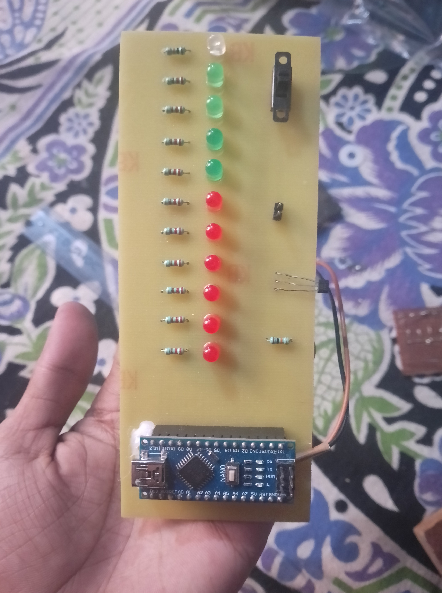
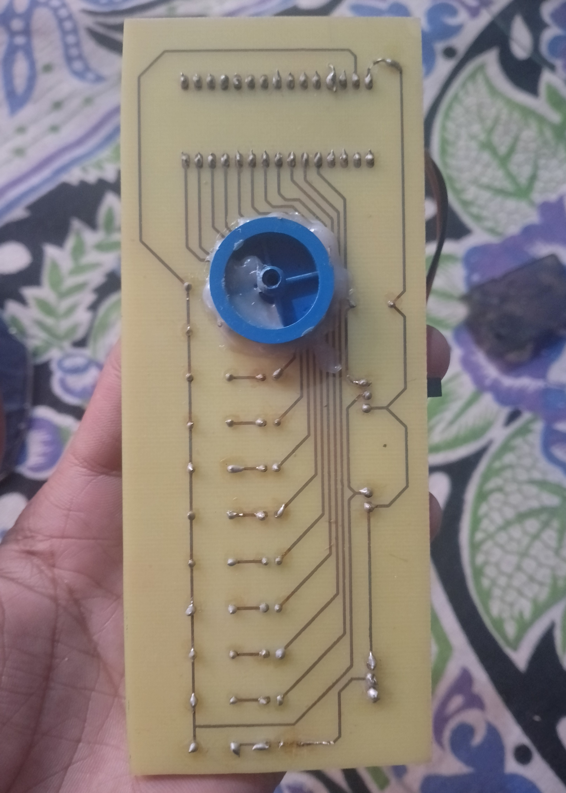
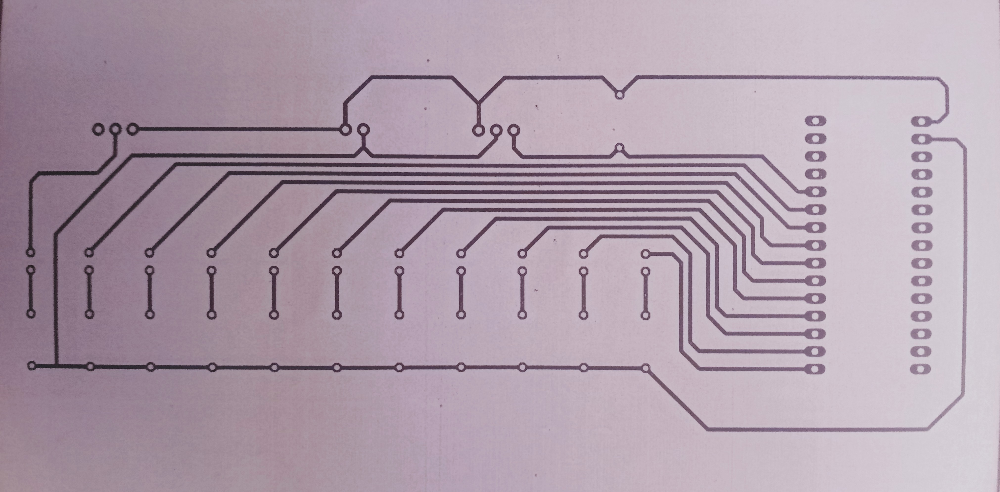

# Analog Propeller Clock

An analog propeller clock is a fascinating and innovative device that creates the illusion of a traditional analog clock using modern technology. It utilizes the persistence of vision (POV) phenomenon, where rapid movement of light points(LED) tricks the human eye into perceiving a continuous image.

    
    
    

# Key Features:

* Persistence of Vision (POV): The clock's hands appear to be static due to  the rapid oscillation of LED lights mounted on a rotating propeller.

* LED Sequence: LEDs are used to display the time in an analog format, creating the visual effect of clock hands.

* Microcontroller: microcontroller controls the LEDs, ensuring they light up at precise intervals to form the clock face.

* Rotating Mechanism: The propeller, which houses the LEDs, rotates at a high speed, typically driven by a motor.

* Compact Design: The clock is often compact, with the rotating propeller mounted on a stand or enclosed within a transparent case.

# Applications:

* Decorative Piece: Serves as a unique and eye-catching decoration.

* Educational Tool: Demonstrates principles of electronics, programming, and the Persistence of Vision effect.
